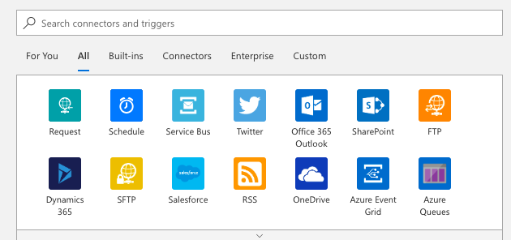
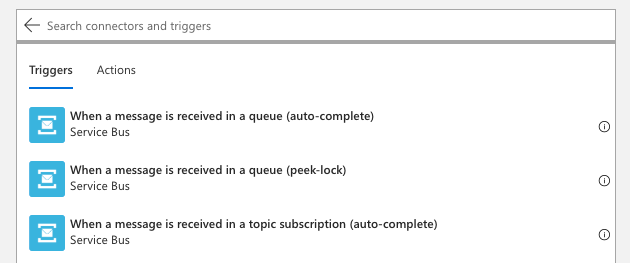
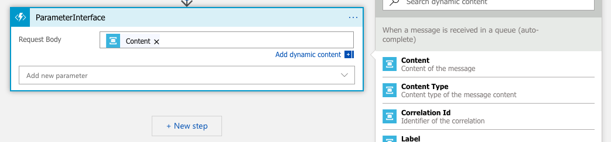
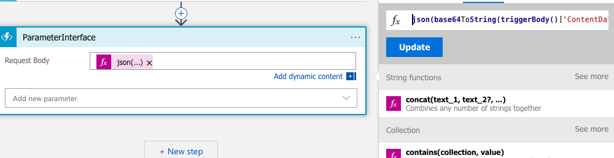
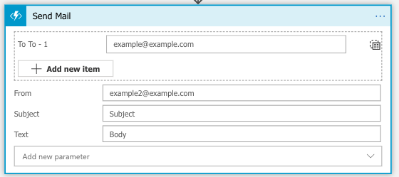

# Logic Apps

> "Azure logic apps simplifies how you build automated scalable workflows that integrate apps and data across cloud services and on-premises systems."  
\- [Microsoft Azure logic apps][1]


## Content
- [Creating a logic app](#Creating-a-Logic-App)
- [Connectors & Triggers](#Connectors-&-Triggers)
    - [Connectors](#Connectors)
    - [Triggers](#Triggers)
- [Calling function apps](#Calling-function-apps)
    - [Service Bus content](#Service-Bus-content)
    - [OpenAPI](#OpenAPI)
        - [Adding a function app with a scheme](#Adding-a-function-app-with-a-scheme)
- [License](#License)


## Creating a logic app
1. Navigate to [portal.azure.com][2]
2. Click ["Create a resource"][3]
3. Search for or find ["logic app"][4]
4. Fill in the information and click "Create"
5. Wait for it to deploy then click "Go to resource"
6. Click on "Blank logic app"


## Connectors & Triggers
### Connectors
\
A connector can contain authentication and other information for a service. This makes it easier to talk to different services in the logic app.

1. Search for and click on the wanted connector
    * If you already have a connector for this service, you can use that.
    * If not it may ask for some information depending on the service.


### Triggers
\
Connectors contains triggers will execute the logic app and usually provide some data to process.

1. After the connector is created, you get a list of triggers.
    * For example under [Service Bus][5], you can execute the logic app if there is a new message in the queue.\
    ["When a message is received in a queue"][6]
2. Select one and fill in the required information
3. You can now refrence the data returned from this trigger in the logic app.


## Calling function apps

You can call [function apps](../function-apps/README.md) in the logic app by adding them as a step. You can then specify the body of the request to the function app.


### Service Bus content

The content of the service bus is base64 encoded json. You can either decode it in the function app, or straight in the logic app using "Expression".
```js
//  - Convert string to JSON
//  |
//  |        - Convert base64 to string
//  |        |
//  |        |                - Body of trigger
//  |        |                |
//  |        |                |             - Get ContentData
//  |        |                |             |
  json( base64ToString( triggerBody()['ContentData'] ) )
```

### OpenAPI

OpenAPI (Swagger) can be used make the function apps more modular. By having a `OpenAPI.yml` file in the trigger´s directory, logic app can use this file to generate input fields in that step.
Then other function´s outputs (that is also using a OpenAPI scheme) can be inserted into.

Check out [Azure´s websites][7] on how to generate an OpenAPI definition.

Example scheme: [OpenAPI.yml](./examples/OpenAPI.yml)

Note: Currently the definition generation is only available to function apps using runtime version 1.\
Ref: [Azure/azure-function-host#2874](https://github.com/Azure/azure-functions-host/issues/2874)


```
FunctionsProject
 | - MyFirstFunction
 | | - index.js
 | | - function.json
 | | - OpenAPI.yml <---------
 | - MySecondFunction
 | | - index.js
 | | - function.json
 | | - OpenAPI.yml <---------
 | - SharedCode
 | | - myFirstHelperFunction.js
 | | - mySecondHelperFunction.js
 | - node_modules
 | - host.json
 | - package.json
 | - extensions.csproj
 | - bin
```
\- Folder structure: [Azure docs][8] (modified)

#### Adding a function app with a scheme
1. Add a new step in the logic app
2. Select "Azure Functions"
3. Select your function app
4. Select the tab "Swagger Actions"
5. Now select the scheme
6. Now if your scheme is correctly formatted it should show the fields you have defined


## TODO
- [ ] Check if a OpenAPI scheme can be manually added to a v2 function.s
- [ ] Write: Using scopes for error-handling
- [ ] Write: Configure Run-after
- [ ] Write: Service bus auto-complete vs peek-lock
- [ ] Write: How peek-lock works and how to configure it


# License

[MIT](LICENSE)


[1]: https://docs.microsoft.com/en-us/azure/logic-apps/
[2]: https://portal.azure.com
[3]: https://portal.azure.com/#create/hub
[4]: https://portal.azure.com/#create/Microsoft.EmptyWorkflow
[5]: https://docs.microsoft.com/en-us/azure/connectors/connectors-create-api-servicebus
[6]: https://docs.microsoft.com/en-us/azure/connectors/connectors-create-api-servicebus#add-trigger-or-action
[7]: https://docs.microsoft.com/en-us/azure/azure-functions/functions-openapi-definition#generate-the-openapi-definition
[8]: https://docs.microsoft.com/en-us/azure/azure-functions/functions-reference-node#folder-structure